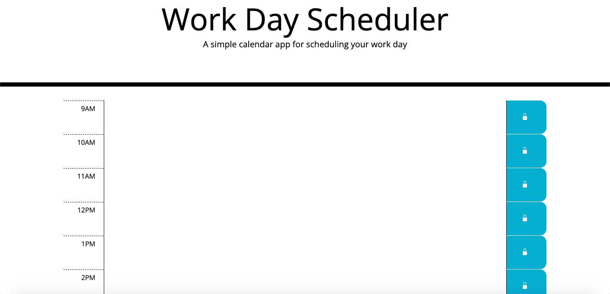

## Objective

As a developer, I was task with creating a week scheduler that would allow the user to input event inside a time block.  The top of the scheduler displays the day of the week followed by the month, date, and year.

## Screenshot of weekly scheduler

